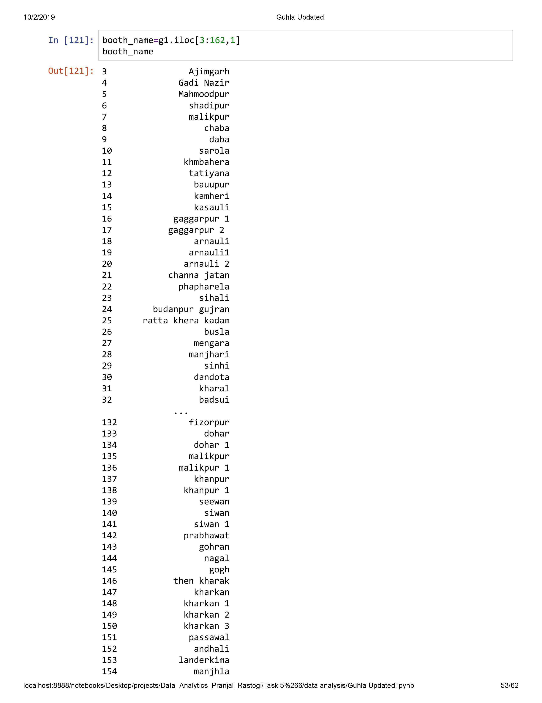
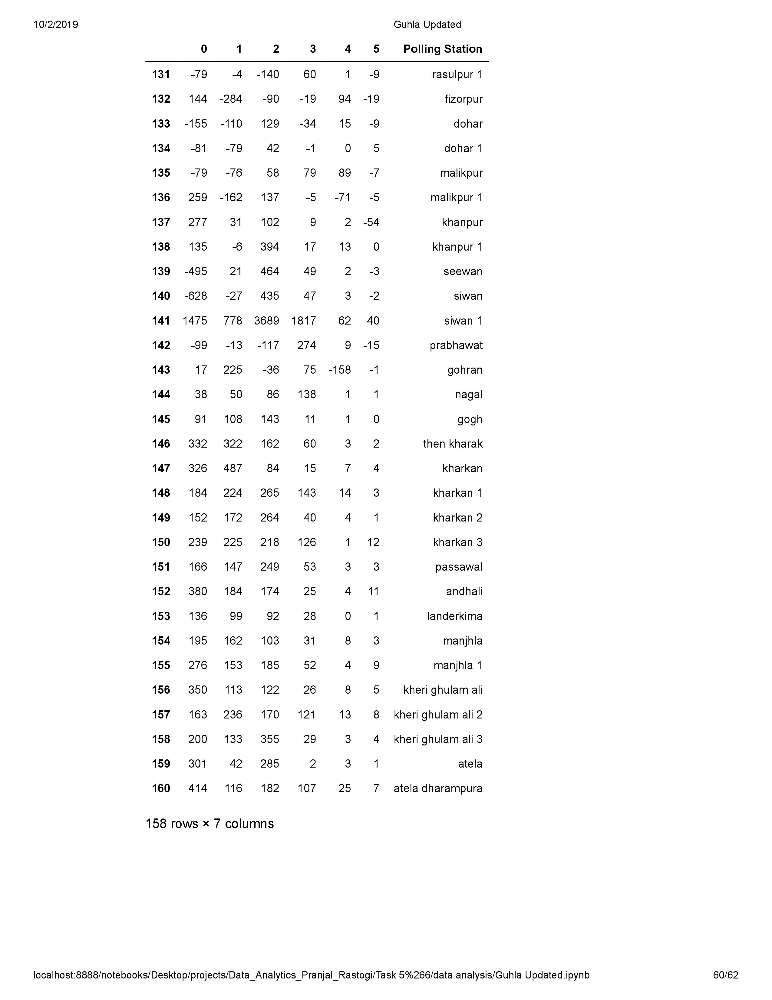

## Abstract
The project ‘Election Analytica’ is about analyzing previous Vidhan Sabha election results for particular constituencies for the state of Haryana, India. 
 The analysis includes judging various parameters such as literacy rate, rural population percentage, employability rate etc with voting pattern for top paties/independent candidates for each constituency in each respective election and to compare them over parameters such as time period, election outcomes to conclude final results.

#### The analysis consists of various steps including:
<ul>
<strong>Collection of data from trusted sources, including surveys</strong> 
<strong>Wrangling of data in proper format</strong> 
<strong>Cleaning of data</strong> 
<strong>Visualisation of data over parameters </strong> 
<strong>Deriving conclusions and results </strong> 
</ul>

The conclusion consists of determination of floating and fixed vote percentage, effect of caste bias and local leadership over electtion results for each constituency or polling stations. Also, analysis includes identification of top candidates/parties over the years hat may have significant impact on the 2019 Lok Sabha elections and analyzing the change in vote percentage for them, over the years with various parameters. Finally some constituencies were pinpointed where Aam Aadmi Party might have higher probability of winning without any existential voter’s base.

### Data Collection
The Data is collected from various trusted sources, some of them are
<ul>
Census report for 1991, 2001, 2011 
Information from Chief election officer of Haryana,  
Reports from website of Election Commision of India 
Information about constituency and candidates from various miscellaneous resources 
</ul>

## Analysis

